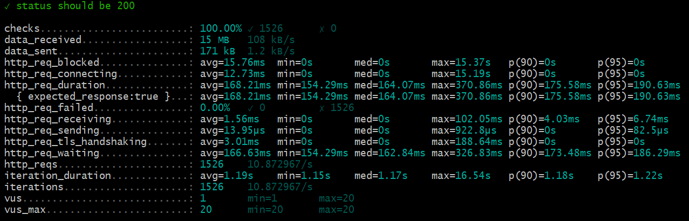

# K6 - Performance Test   

K6 é uma ferramenta para executar alguns tipos de teste de performance. A maneira de programar o teste é através da sintaxe do Javascript, porém toda sua engine é através de Golang, dada a desenvoltura de Go para execução com boa performance.   


Segue a Documentação do k6:  
[Detalhes sobre o k6](https://k6.io/docs/)     


* Execução básica do teste deve informar o nome do arquivo que deve ser executado.
`k6 run script.js`  

* Execucação acrescentando virtual users e duração do teste via CLI (`vus`)  
`k6 run  --vus 10 --duration 30s script.js`  


## Análise das Metricas    

As métricas no k6 aparecem na saída com o resultado dos testes, ao lado esquerdo dos valores.  

    

Descrição das métricas: [Detalhe das métricas](https://k6.io/docs/using-k6/metrics/reference/)

## Valores das métricas  

* __min__ = minima. O menor tempo de resposta de uma requisição.    

* __max__ = maxima. O maior tempo de resposta de uma requisição.  

* __avg__ = média. O total da soma de total as requisições dividida pela quantidade de requisições.    

* __med__ = mediana. O valor real que está entre (ao meio) de todas as requisições.  

* __p__ = percentil. O valor que atenda uma determinada porcentagem da amostra. Por exemplo: 90% dos usuários tiveram tempo de resposta de até 1.7 segundos.     

Podemos também customizar as métricas: [Custom Metrics](https://k6.io/docs/using-k6/metrics/create-custom-metrics/)  
Exemplo de métricas customizadas: [metricas customizadas](./thresholds-all.js)     

As métricas no K6 estão organizadas pelos seguintes tipos de métricas:    

* __Conters__ soma de valores.
* __Gauges__  identifica o menor, o maior e o último valor.  
* __Rates__   frequencia que um valor diferente de zero ocorre.   
* __Trends__  é a porcentagem.   

É atraveés deste tipos de métricas que podemos criar outras de maneira customizada. Como o exemplo do código dentro de `thresholds-all.js`.  


## Assertions (Checks)  

Através dos checks no K6, podemos validar as respostas que esperamos para determinados cenários. Como por exemplo, tempo de resposta, quantidade de caracteres no response body, status code da requisição, conteúdo do response body, entre outras. Segue a documentação com mais exemplos:      

[Checks/Assertions](https://k6.io/docs/using-k6/checks/)   


## Thresholds   

São critérios definidos que o teste deve cumprir  durante a execução, em função de uma ou mais __métricas__ definidas. Esses critérios que definirão se o teste passou ou falhou.    

```javascript
 trhesholds:{
      http_req_failed: ['rate<0.01'],
      http_req_duration: ['p(95)<200'],
    }
```   

No exemplo acima, temos definido que para a metrica `http_req_failed` o cirtério de falha deve ser menor que 1% (threshold `['rate<0.01']`). E para a métrica `http_req_duration`, o critério deve ser que 95% dos usuários devem obter o tempo de resposta da requisição menor que 200 ms (threshold `['p(95)<200']`).   

Definições de Threshold abaixo:     

[Threshold](https://k6.io/docs/using-k6/thresholds/)  
